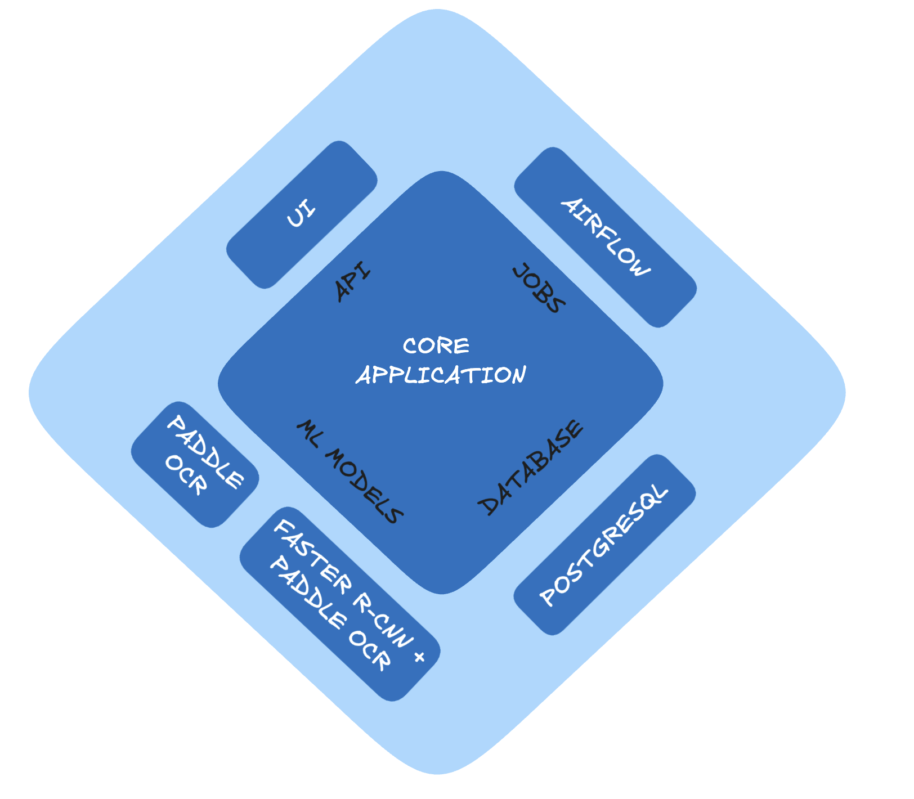

Code Documentation
==================

The code is divided into the following modules
This repo uses `Hexagonal Architecture <https://en.wikipedia.org/wiki/Hexagonal_architecture_(software)>`_ to separate the concerns of the application and make the external modules interchangeable.

Views
-----
Path: documentapp/views.py
Contains the views for the frontend.

API
---
Path: documentapp/api.py

Contains:
- REST API for Document Template, Document Sample and Boxes.
- Job API for Document Sample Generation and Model Training.

OCRPredictor
-------------
Path: documentapp/ocr_predictor.py

Adapters for OCR predictions.
Implement the predict method to predict the content of a document image.

Currently supported implementations include PaddleOCR or Faster R-CNN+PaddleOCR.

Jobs
----
Path: documentapp/jobs.py

Adapters for jobs running.
Implement the run_job method to run the job.

Currently implemented with Airflow.
