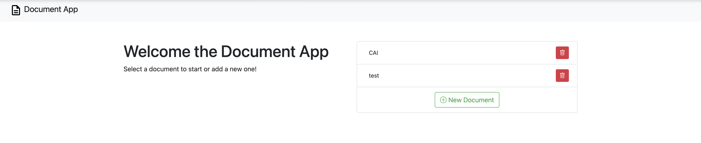
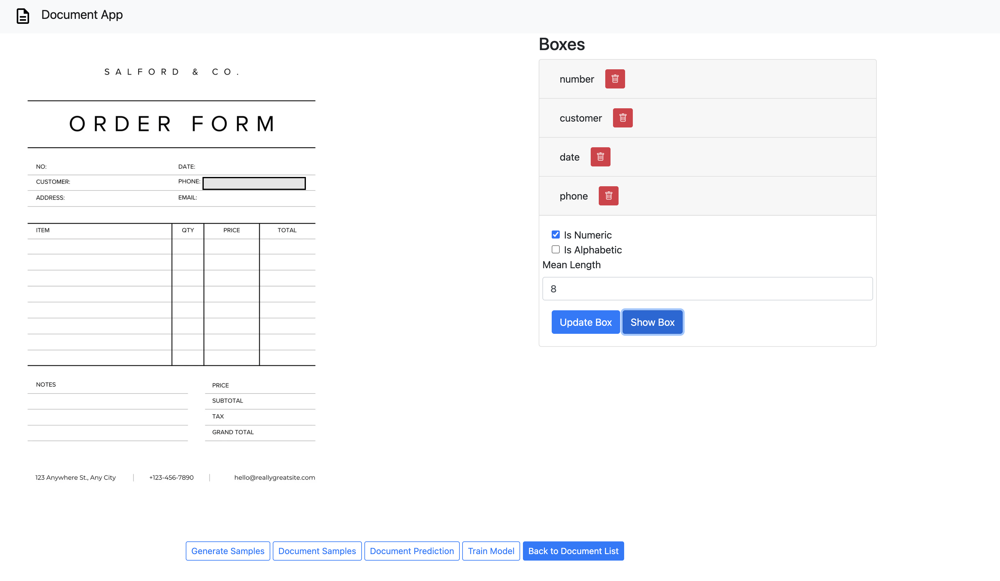
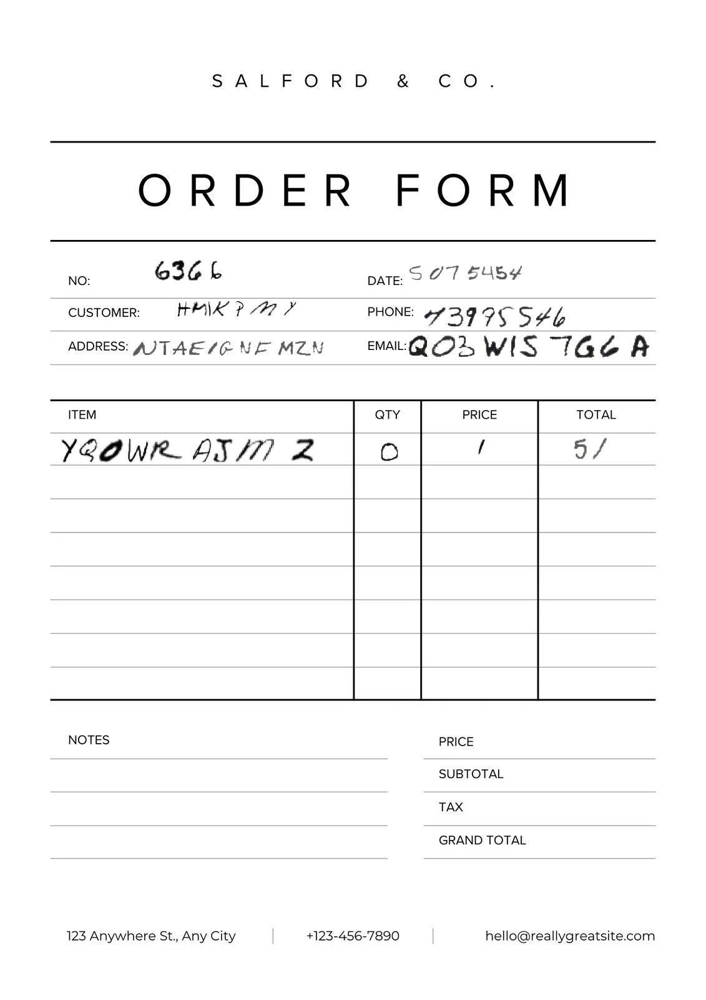
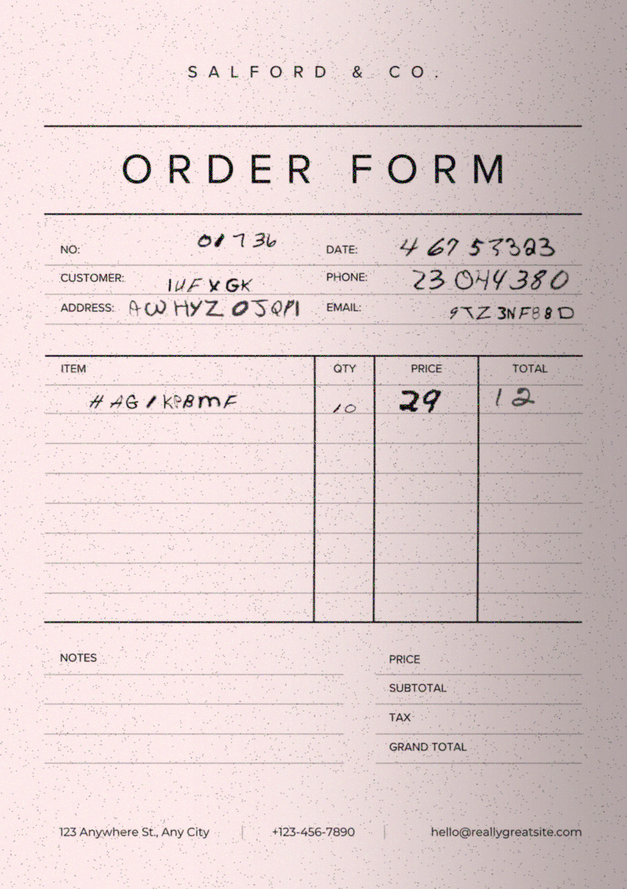
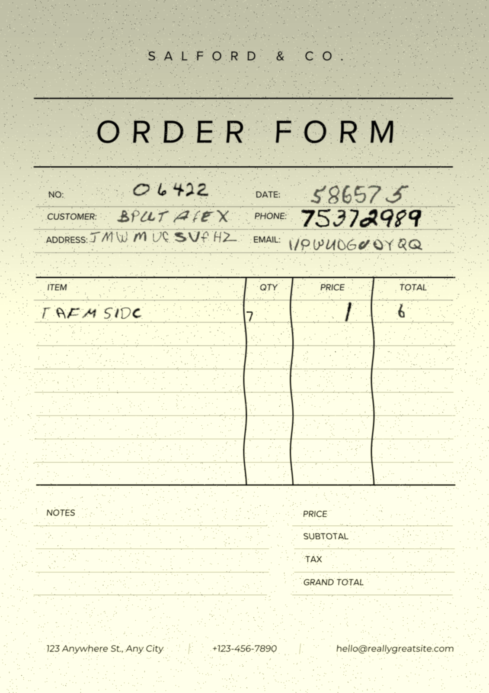
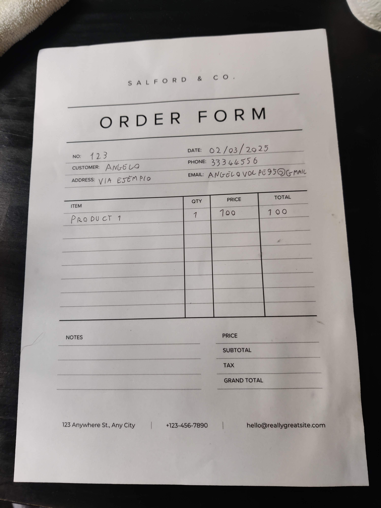
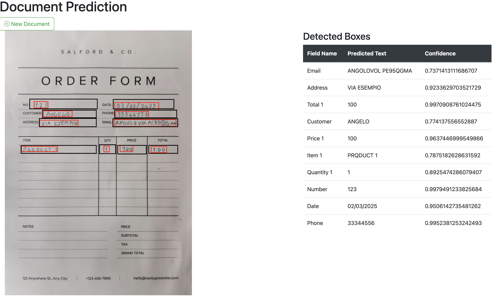

Usage
=====

You can access the main page at `<http://localhost:8000/document_app/>`_ after running the server.

Upload a new Template Document
------------------------------

From the main page, click on the `New Document` button to upload a new document.

Choose the document file and name and click on the `Upload` button.

Then the new document will appear on the list of documents.

Document Detail Page
------------------------------

By clicking on the document name, you can access the document detail page.
This page allows you to do various operations on the document:

* **Draw New Boxes** - This functionality is triggered by clicking on the image and dragging the mouse to draw a box.
* **Edit Boxes** - You can edit the boxes by clicking on the box name in the list setting the properties.
* **Generate Samples** - By clicking this button you will be asked for the number of samples to generate and then you can start the generation job.
* **Document Samples** - This button allows to access the generated samples.
* **Document Prediction** - This button allows to access the prediction page.
* **Train Model** - This button allows to start the model ocr fine tuning job.

Document Samples Page
----------------------------
This page allows you to access the generated samples and view them one by one.
Here are some examples of the generated samples:

|sample_1| |sample_2| |sample_3|

Document Prediction Page
------------------------------

This page allows you to upload a document image and run the fine tuned OCR to predict the content and automatically associate it to the boxes.

Example real document:

Then you can see the document preprocessed with predicted content and the associated boxes.

